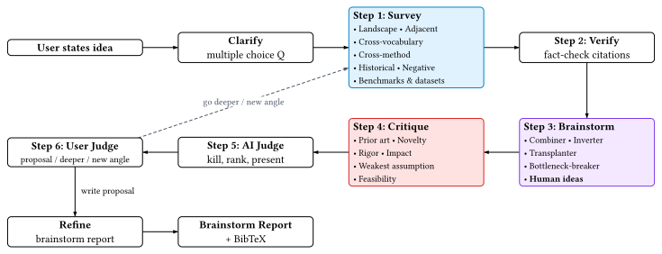

# sci-brain

An AI-powered research brainstorming partner. Tell it a research topic — it surveys the literature, helps you find good problems, and shapes concrete research ideas together with you.

Works with [Claude Code](https://claude.ai/claude-code), [Codex](https://github.com/openai/codex), and [OpenCode](https://github.com/opencode-ai/opencode). Skill format inspired by [superpowers](https://github.com/obra/superpowers).

## Quick Start

**Claude Code:**

```
/plugin marketplace add QuantumBFS/sci-brain
/plugin install sci-brain@sci-brain
```

Then in any session, type one of these commands:

| Command | What it does |
|---------|-------------|
| `/survey` | Survey a research topic |
| `/ideas` | Brainstorm research ideas (works best after a survey) |
| `/writer` | Write up your chosen idea as a polished document |
| `/researchstyle` | Index your personal paper collection |

## What It Does



### 1. Survey a topic

You name a research area. The AI searches in parallel using multiple strategies — landscape mapping, adjacent subfields, cross-vocabulary, cross-method, historical lineage, negative results, and benchmarks. You pick which directions look interesting, and it builds a **survey registry** with verified BibTeX. You can also export discovered papers to your Zotero library.

### 2. Brainstorm ideas

A Socratic research collaborator that understands your background (from your Zotero library, Google Scholar profile, or self-description). It suggests problems worth working on — filtered by practical impact, theoretical openness, and fit with your skills — then dives in with you, asking one question at a time to narrow a broad direction into a concrete, attackable research idea.

### 3. Write it up

Produces a structured document (Typst, LaTeX, or Markdown) from the full reasoning trail — survey findings, ideas explored, what was killed and why, and the surviving direction with BibTeX references.

## Get Better Results

**Index your papers.** Run `/researchstyle` to index your Zotero library, PDF folder, or Google Scholar profile. This lets the AI search your collection during brainstorming and calibrate suggestions to your taste.

**Describe your research style** in `CLAUDE.md` (or `AGENTS.md` for other platforms):

```markdown
# Research context
My Google Scholar: https://scholar.google.com/citations?user=XXXX
My research interests: quantum computing, tensor networks
I prefer rigorous theoretical work over empirical benchmarks.
```

**Point to your Zotero** if it's not at the default `~/Zotero/`:

```markdown
# PDF library
My Zotero library is at ~/custom/path/Zotero/
```

**Configure MCP servers** for deeper literature search and Zotero integration:

| MCP server | When it helps |
|------------|---------------|
| [arxiv-mcp-server](https://github.com/blazickjp/arxiv-mcp-server) | Search arxiv by topic. Download full papers to verify claims |
| [paper-search-mcp](https://github.com/langrocks/paper-search-mcp) | Search PubMed, bioRxiv, CrossRef — essential for biomedical topics |
| [Semantic Scholar MCP](https://github.com/YUZongmin/semantic-scholar-mcp) | Follow citation chains to find related work. Check novelty |
| [Zotero MCP](https://github.com/kujenga/zotero-mcp) | Search your existing library, read full text of PDFs you already have |

Without MCP servers, the workflow falls back to web search — still works, just less thorough.

## Installation (Other Platforms)

### Codex

Tell Codex:

```
Fetch and follow instructions from https://raw.githubusercontent.com/QuantumBFS/sci-brain/refs/heads/main/.codex/INSTALL.md
```

### OpenCode

Tell OpenCode:

```
Fetch and follow instructions from https://raw.githubusercontent.com/QuantumBFS/sci-brain/refs/heads/main/.opencode/INSTALL.md
```

### Updating

```bash
# Codex
cd ~/.codex/sci-brain && git pull

# OpenCode
cd ~/.config/opencode/sci-brain && git pull
```

For Claude Code, use the plugin marketplace update workflow.

## Output

**Survey registry** (persists across sessions):

```
~/.claude/survey/<topic>/
  summary.md        # Papers by sub-theme, open problems, bottlenecks
  references.bib    # BibTeX with abstract + doi/url per entry
```

**Ideas report:**

```
articles/
  YYYY-MM-DD-<topic>-ideas-report.md      # Full reasoning trail
  YYYY-MM-DD-<topic>-ideas-report.typ      # Polished document
  YYYY-MM-DD-<topic>-references.bib        # BibTeX references
```

## Contributors

**Initiator**: [Lei Wang](https://github.com/wangleiphy) and [Jin-Guo Liu](https://github.com/GiggleLiu)

## License

MIT. Feel free to adapt from the current code based, BUT please acknowledge this package properly, thank you.
