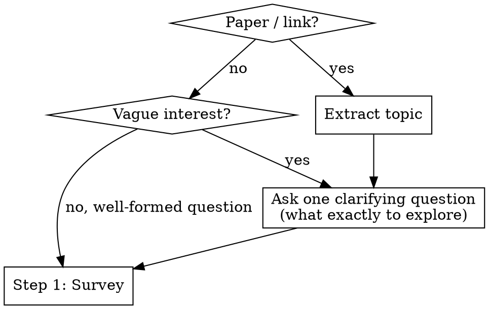
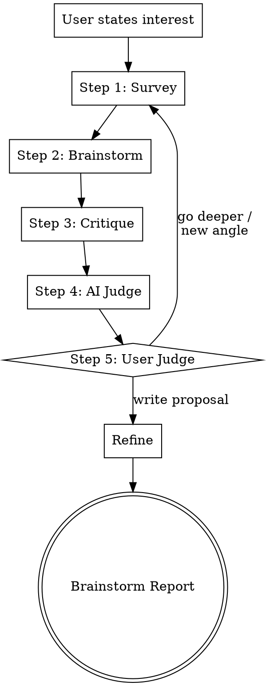

# Scientific Research Brainstorming

Research-first brainstorming adapted from the **FIDS framework** (Feel → Imagine → Do → Share).

Iterative loop: survey the field, brainstorm ideas, critique them (including source verification), then let the user decide whether to go deeper or write the proposal. Produces a research plan.

## Entry

### Step 0 — Get to know the researcher

Before anything else, ask permission to learn about the user's research background. This helps calibrate the entire session.

> "Before we start — can I learn a bit about your research background? I can:
> - **(a)** Search your local Zotero library for papers you've collected
> - **(b)** Browse your Google Scholar profile for your publications
> - **(c)** Both
> - **(d)** Skip — just start brainstorming"

**Based on the user's choice:**
- **(a)** Run the [Zotero lookup](#zotero-lookup) procedure. Summarize what you find: "You have N papers, mostly in [topics]. Recent focus seems to be [X]."
- **(b)** Fetch the Google Scholar profile (from `CLAUDE.md` or ask for the URL). Summarize: "You've published on [topics], recent work on [X], h-index Y."
- **(c)** Do both.
- **(d)** Skip. If Zotero is not auto-detected and no Scholar link is configured, print the fallback message (see [Zotero Lookup](#zotero-lookup)) and proceed.

This runs once per session, not per loop iteration.

### Clarify the research question

Then ask **one** clarification question to understand what the user actually wants to explore. Focus on narrowing the research question.



**Clarification principles:**
- **One question at a time.** Never ask multiple questions in one message.
- **Prefer multiple choice** when you can infer 2-3 plausible directions — easier for the user to pick than open-ended.
- **Focus on the actual research question:** what exactly do they want to understand, solve, or build?

## Process

Run the loop iteratively. Each iteration runs all 5 steps. The AI adapts survey strategies per iteration based on knowledge gaps. The loop repeats until the user picks a direction and exits to Refine.

**One question at a time.** Never ask multiple questions in one message.



**Before starting each step, invoke the corresponding skill for detailed instructions:**

- **Step 1 (Survey):** invoke `survey`
- **Step 2 (Brainstorm):** invoke `brainstorm`
- **Steps 3-5 (Critique → AI Judge → User Judge → Loop Handoff):** invoke `critique`
- **Refine:** invoke `writer`

## Zotero Lookup

The user's personal Zotero library is a high-value source — it contains papers they already know and trust. Search it before external sources.

**Step 1 — Locate the Zotero data directory:**
1. Check standard paths: `~/Zotero/`, `~/Library/Application Support/Zotero/` (macOS alternate)
2. Look for `zotero.sqlite` in the directory
3. If not found, ask the user for the path (one question)

**Step 2 — Search by keyword via SQLite:**
```bash
sqlite3 ~/Zotero/zotero.sqlite "
  SELECT i.itemID, v_title.value AS title, v_abstract.value AS abstract
  FROM items i
  JOIN itemData id_t ON i.itemID = id_t.itemID
  JOIN itemDataValues v_title ON id_t.valueID = v_title.valueID
  JOIN fields f_t ON id_t.fieldID = f_t.fieldID AND f_t.fieldName = 'title'
  LEFT JOIN itemData id_a ON i.itemID = id_a.itemID
  LEFT JOIN fields f_a ON id_a.fieldID = f_a.fieldID AND f_a.fieldName = 'abstractNote'
  LEFT JOIN itemDataValues v_abstract ON id_a.valueID = v_abstract.valueID
  WHERE v_title.value LIKE '%KEYWORD%'
     OR v_abstract.value LIKE '%KEYWORD%'
  LIMIT 20;
"
```

**Step 3 — Find PDFs for matched items:**
```bash
sqlite3 ~/Zotero/zotero.sqlite "
  SELECT ia.parentItemID, ia.key, ia.contentType
  FROM itemAttachments ia
  WHERE ia.parentItemID IN (ITEM_IDS)
    AND ia.contentType = 'application/pdf';
"
```
PDFs are stored at `~/Zotero/storage/<key>/<filename>.pdf`.

**Step 4 — Analyze matched PDFs:**
- Use the **Read** tool to read PDFs directly (supports PDF reading)
- For bulk keyword search across many PDFs: `pdfgrep -r -i "KEYWORD" ~/Zotero/storage/` (install via `brew install pdfgrep` if missing)
- For each relevant paper found, extract: title, key claims, methods, results relevant to the research question

**Fallback:** If Zotero is not found, print the following message and proceed with external sources:

> Could not locate a local PDF library (Zotero). Proceeding with online sources only. If you have a paper collection, you can add your research preferences and PDF locations to `CLAUDE.md` or `AGENTS.md` — for example:
>
> ```
> My Zotero library is at ~/Zotero/
> My PDFs are in ~/Papers/
> My Google Scholar: https://scholar.google.com/citations?user=XXXX
> My research interests: [topic], [topic]
> ```
>
> This helps the AI understand your research style, find your local papers, and browse your publication history in future sessions.

Do not ask more than once per session.

## Edge Cases

| Situation | Handling |
|-----------|---------|
| User already has a well-formed research question | Skip Entry, start loop at Step 1 |
| Survey reveals idea is already published | Present prior art in survey synthesis, ask if user sees a different angle |
| No cross-field connections found | Proceed with within-field survey; Transplanter lens may still find methods from other fields |
| Zotero not installed | Skip local library search, proceed with external sources only |
| MCP tool unavailable | Fall back to WebSearch only |
| User disagrees with critique | Present evidence, let user decide — user always has final say at Step 5 |
| All ideas killed in Step 4 | Report what was learned, suggest new angles, loop back to Step 1 with adjusted strategies |

## Guardrails

- Never fabricate citations — only present what tools actually found.
- Never assert novelty judgments — present evidence, let user evaluate.
- Source verification happens during critique (Step 3), not before brainstorming — survey sources are reliable, but brainstorm claims must be checked.
- Always preserve pivot path — show what's salvageable when critique kills an idea.
- Cite sources with bibtex — every literature claim includes paper title or URL.
