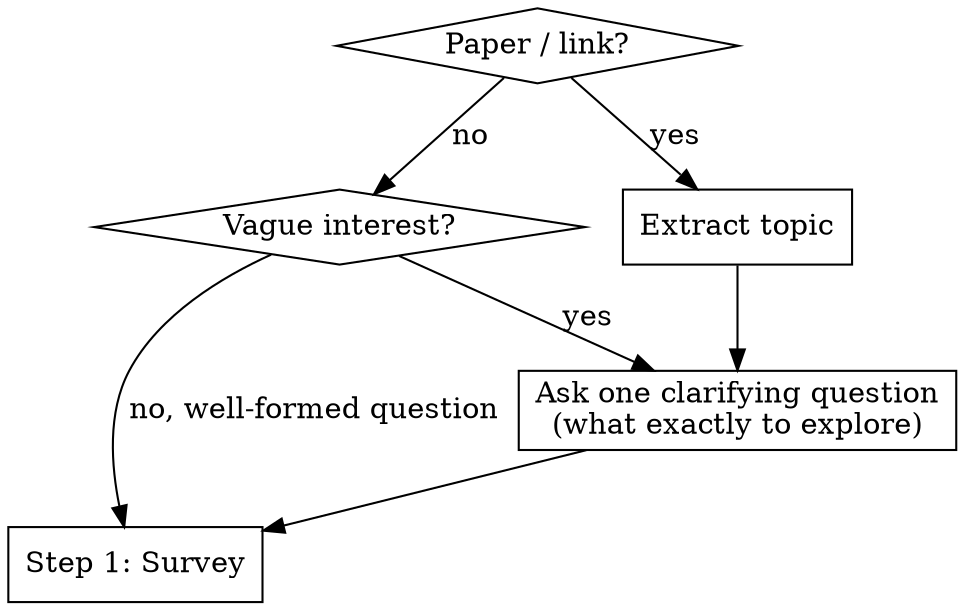
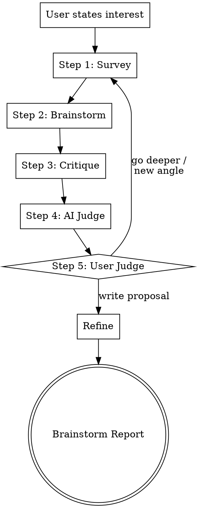

# Scientific Research Brainstorming

Polya-style brainstorming for research ideas.

## Entry

### Step 0 — Get to know the researcher

Before anything else, try to understand the user's research background. This helps calibrate the entire session.

**Auto-detect personal registry:** Check for an existing personal registry at `articles/personal-registry/` (the default output of the `researchstyle` skill). Also check `CLAUDE.md`/`AGENTS.md` for a configured registry path.

**If found:** Read `summary.md` to understand the user's research interests. Summarize: "I found your personal registry — you have N papers, mostly in [topics]. Recent focus seems to be [X]."

**If not found:** Ask:

> "I'd like to understand your research background. I can:
> - **(a)** Build a personal registry now — index your Zotero, a PDF folder, or Google Scholar (uses the `researchstyle` skill)
> - **(b)** Load an existing registry — give me the path to a previously generated one
> - **(c)** Skip — just start brainstorming"

**Based on the user's choice:**

- **(a)** Invoke the `researchstyle` skill. Once the registry is created, read the summary and continue.
- **(b)** Read the registry at the given path. Summarize what you find.
- **(c)** Skip. Proceed without personal context.

This runs once per session, not per loop iteration.

### Clarify the research question

Then ask **one** clarification question to understand what the user actually wants to explore. Focus on narrowing the research question.

**Clarification principles:**
- **One question at a time.** Never ask multiple questions in one message.
- **Prefer multiple choice** when you can infer 2-3 plausible directions — easier for the user to pick than open-ended.
- **Focus on the actual research question:** what exactly do they want to understand, solve, or build?

## Process

Run the loop iteratively. Each iteration runs all 5 steps. The AI adapts survey strategies per iteration based on knowledge gaps. The loop repeats until the user picks a direction and exits to Refine.

**One question at a time.** Never ask multiple questions in one message.

**Before starting each step, invoke the corresponding skill for detailed instructions:**

- **Step 1 (Survey):** invoke `survey`
- **Step 2 (Brainstorm):** invoke `brainstorm`
- **Steps 3-5 (Critique → AI Judge → User Judge → Loop Handoff):** invoke `critique`
- **Refine:** invoke `writer`

## Edge Cases

| Situation | Handling |
|-----------|---------|
| User already has a well-formed research question | Skip Entry, start loop at Step 1 |
| Survey reveals idea is already published | Present prior art in survey synthesis, ask if user sees a different angle |
| No cross-field connections found | Proceed with within-field survey; Transplanter lens may still find methods from other fields |
| No personal registry found | Offer to create one with `researchstyle` skill, load an existing one, or skip |
| MCP tool unavailable | Fall back to WebSearch only |
| User disagrees with critique | Present evidence, let user decide — user always has final say at Step 5 |
| All ideas killed in Step 4 | Report what was learned, suggest new angles, loop back to Step 1 with adjusted strategies |

## Guardrails

- Never fabricate citations — only present what tools actually found.
- Never assert novelty judgments — present evidence, let user evaluate.
- Source verification happens during critique (Step 3), not before brainstorming — survey sources are reliable, but brainstorm claims must be checked.
- Always preserve pivot path — show what's salvageable when critique kills an idea.
- Cite sources with BibTeX — every literature claim includes paper title or URL.
