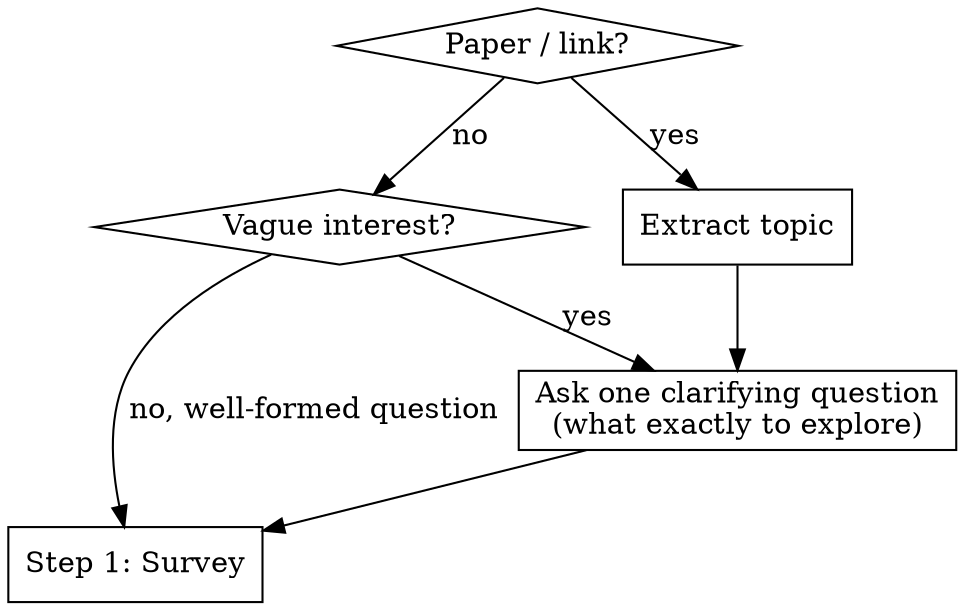
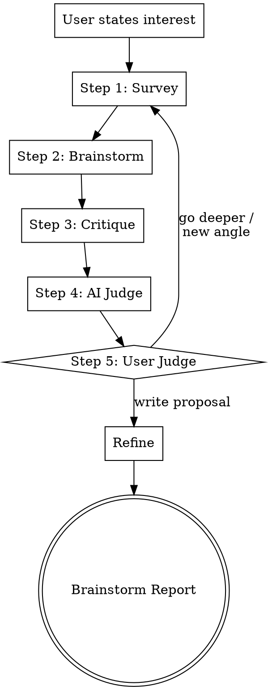

# Scientific Research Brainstorming


Research-first brainstorming adapted from the **FIDS framework** (Feel → Imagine → Do → Share).

Iterative loop: survey the field, brainstorm ideas, critique them (including source verification), then let the user decide whether to go deeper or write the proposal. Produces a research plan.

## Entry

### Step 0 — Get to know the researcher

Before anything else, ask permission to learn about the user's research background. This helps calibrate the entire session.

> "Before we start — can I learn a bit about your research background? I can:
> - **(a)** Search your local Zotero library for papers you've collected
> - **(b)** Browse your Google Scholar profile for your publications
> - **(c)** Both
> - **(d)** Skip — just start brainstorming"

**Based on the user's choice:**
- **(a)** Run the [Zotero lookup](#zotero-lookup) procedure. Summarize what you find: "You have N papers, mostly in [topics]. Recent focus seems to be [X]."
- **(b)** Fetch the Google Scholar profile (from `CLAUDE.md` or ask for the URL). Summarize: "You've published on [topics], recent work on [X], h-index Y."
- **(c)** Do both.
- **(d)** Skip. If Zotero is not auto-detected and no Scholar link is configured, print the fallback message (see [Zotero Lookup](#zotero-lookup)) and proceed.

This runs once per session, not per loop iteration.

### Clarify the research question

Then ask **one** clarification question to understand what the user actually wants to explore. Focus on narrowing the research question.



**Clarification principles:**
- **One question at a time.** Never ask multiple questions in one message.
- **Prefer multiple choice** when you can infer 2-3 plausible directions — easier for the user to pick than open-ended.
- **Focus on the actual research question:** what exactly do they want to understand, solve, or build?

## Process

Run the loop iteratively. Each iteration runs all 5 steps. The AI adapts survey strategies per iteration based on knowledge gaps. The loop repeats until the user picks a direction and exits to Refine.

**One question at a time.** Never ask multiple questions in one message.



### Step 1 — Survey (parallel exploration)

Map the landscape before any discussion. Launch N subagents in parallel. The AI selects exploration strategies dynamically based on what is known vs. unknown. First iteration is broad; later iterations focus on gaps identified in previous iterations.

**Strategy menu (AI picks from these based on iteration context):**

Each subagent uses only its **primary sources** — not all sources. This keeps each subagent fast (2-4 tool calls, not 10+).

| # | Strategy | When to use | Primary sources |
|---|----------|-------------|-----------------|
| 1 | **Landscape mapping** | First iteration default — broad field overview | Semantic Scholar (citation graph) + arxiv |
| 2 | **Adjacent subfield** | Deep-dive into a neighboring cluster identified in prior iteration | arxiv + Semantic Scholar |
| 3 | **Cross-vocabulary** | Abstract away jargon, search other fields for the same structural problem | WebSearch + paper-search-mcp |
| 4 | **Cross-method** | Same problem, different computational or experimental approaches | paper-search-mcp + arxiv |
| 5 | **Historical lineage** | Who tried before, what failed, what changed since | Semantic Scholar (citation chains) |
| 6 | **Negative results** | Search for papers showing what does not work | arxiv + WebSearch |
| 7 | **Benchmarks and datasets** | What evaluation infrastructure exists | WebSearch + arxiv |

**Available sources** (subagents pick from these — not all of them):
- **User's Zotero library** (local-first) — search the user's own paper collection. See [Zotero lookup](#zotero-lookup). Only available if the user granted access in Step 0 (options a/c). If the user chose (d) skip or (b) Scholar only, do not use Zotero in any survey subagent.
- **arxiv MCP** — search topic, read abstracts
- **paper-search-mcp** — PubMed, bioRxiv, CrossRef for non-CS hits
- **Semantic Scholar MCP** — citation graphs, clusters, seminal works
- **WebSearch** — blog posts, talks, open problem lists

**Abstracts first, PDFs later.** At survey stage, subagents record paper identifiers (DOI, arxiv ID) so they can be fetched later during critique (Step 3) when specific claims need verification.

Each subagent produces a **summary report** saved to `articles/iteration-N/survey/strategy-<name>.md`. The report contains:

- **Field landscape** — what was found, key papers clustered by sub-theme with publication years, active research groups, citation graph shape, temporal trends (when did activity peak? is this area heating up or cooling down?)
- **Key open problems** — what are the important unsolved questions in this area?
- **Key bottlenecks** — what specific obstacles prevent progress on those problems?
- **References** — paper identifiers (DOI, arxiv ID, title, authors, year) and BibTeX entries. No full PDFs at this stage — just enough metadata to fetch them later if needed during critique.

**Main agent reads the summaries** — not individual search results. The summaries are the interface between subagents and the main agent. If a claim seems questionable, the main agent can re-search or fetch an abstract, but this is the exception, not the default.

**Ask:** "Which directions interest you? Pick one or more." List all major findings as numbered options. The user can select multiple.

**Fetch key PDFs:** After the user picks, download full PDFs for the key references related to the selected directions (typically 3-8 papers). Use the paper identifiers (DOI, arxiv ID) collected during survey. Save to `articles/iteration-N/survey/<first-author>-<year>-<short-title>.pdf`. Read them to extract methods, results, and details that abstracts miss — this deeper understanding feeds into brainstorming.

**Survey synthesis:** Based on the user's picks and the full-paper reads, the main agent writes a single focused **survey report** in markdown — consolidating the relevant findings into one coherent narrative with inline citations. Save to `articles/iteration-N/SURVEY-REPORT.md`.

### Step 2 — Brainstorm (human first, then AI)

Human and AI brainstorm independently and in parallel — neither side sees the other's ideas, so there is no anchoring in either direction. All ideas enter critique on equal footing.

**Step 2a — Human brainstorm + AI brainstorm (launched simultaneously):**

Present the survey report, then start the human brainstorm conversation while launching AI subagents in the background.

**AI subagents run in parallel with the human conversation.** Each receives only the survey report from Step 1 — **not** the human's ideas. This keeps both sides independent.

**Human brainstorm conversation (5+ questions, one at a time):**

A harsh but constructive interview. Push the human from vague to concrete, from weak to strong. Be direct — demand specifics, push back on hand-waving. Stop only when the human says stop.

**Formatting:** Prefix every brainstorm question with `>>>` so it stands out in the CLI. Example: `>>> What specifically is new here?`

**Phase 1 — Open.** Get the human talking:

> `>>> Based on what we've found, what directions interest you? Even a vague hunch is fine — we'll sharpen it together.`

**Phase 2 — Explore.** Dig into whatever the human gravitates toward. Connect their instincts to the survey:
- `>>> You mentioned X — what specifically about that excites you?`
- `>>> That connects to [paper Y] which found [Z] — does that change your thinking?`
- If stuck, throw survey findings to provoke a reaction: `>>> The survey found [method X] failed because [Y] — does that suggest an angle?`

**Phase 3 — Sharpen.** Once a direction emerges, pressure-test it. Use Polya and Lei Wang criteria to force clarity:
- *What's new?* — `>>> What specifically is new here? What is the unknown, the data, the conditions?` (Polya)
- *Why now?* — `>>> Why can this be solved now? What changed — new data, methods, compute, theory?` (Lei Wang)
- *Why you?* — `>>> Why hasn't anyone done this before? What's your unique advantage?` (Lei Wang)
- *What's the plan?* — `>>> Do you know a related problem with a known solution? Can you adapt it?` (Polya)
- *What's the test?* — `>>> What's the minimal experiment? What would you measure?` (Polya)
- *What could go wrong?* — `>>> What has to be true for this to work? Which assumption worries you most?`

**Phase 4 — Pivot if needed.** If an idea is weak, don't kill it — redirect: `>>> What if instead of [weak version], you tried [stronger version] inspired by [survey finding]?`

By the end, the human should have at least one idea that is concrete enough to enter critique.

**Creative lenses (one subagent per lens):**

| Lens | Strategy | Search focus |
|------|----------|-------------|
| **Combiner** | Combine two distant findings into a novel approach | Search for prior attempts at this combination |
| **Inverter** | Invert a key assumption — what if the opposite is true? | Search for evidence supporting the inverted assumption |
| **Transplanter** | Apply a method from field A to problem B | Search field A for concrete methods and their results |
| **Bottleneck-breaker** | Directly attack the identified bottleneck | Search for recent tools, techniques, or compute advances that could break it |

**Each subagent produces:**
0-2 Concrete ideas, each with a paragraph summary, explain why it is interesting or practically important, and why it might work, refer to the relevant survey findings

**Step 2b — Merge and present all ideas:**

Combine human ideas + AI ideas into a single numbered list. Apply the sharpening criteria (Polya + Lei Wang, from the questioning strategy above) to each AI idea as well — fill in any gaps. Present to the user before moving to critique.

Save brainstorm reports to `articles/iteration-N/brainstorm/`.

### Step 3 — Critique (adversarial review + source verification)

Try to kill each idea with evidence — AI ideas and human ideas alike. Whatever survives is worth considering. This is also where source claims get fact-checked.

**Each brainstorm idea (AI or human) is paired with a devil's advocate subagent that:**
- Searches for prior art (has this been tried?) via **Semantic Scholar MCP** (citation chains) + **arxiv MCP** (novelty claim, negative results) + **paper-search-mcp** (cross-database) + **WebSearch** (blog posts, workshop papers)
- **Verifies key references** — for each idea, identify the small number of references that the idea's validity depends on (not every citation — just the load-bearing ones). Fetch the full PDF if needed (survey only collected abstracts). Check that these papers exist, that the cited claims match the actual content, and flag any misrepresentations
- Identifies the weakest assumption
- Estimates feasibility (what would it actually take?)
- Rates on four axes:

| Axis | Challenge |
|------|-----------|
| **Source reliability** | "Which references does this idea stand or fall on? Do those key papers actually claim what's stated?" |
| **Novelty** | "I found [paper X] very similar. How is this different?" |
| **Rigor** | "State the core claim as a testable hypothesis." |
| **Impact** | "If this works perfectly, what improvement? Enough for [venue]?" |

**Evidence-backed critique:** Every critique claim must be supported by a search. If the devil's advocate says "this has been tried before," it must find the paper. If it says "this won't scale," it must find evidence or a concrete argument for why. No unsupported opinions — critique without evidence is just noise. When a critique point is questionable or uncertain, the subagent must search for supporting evidence before including it in the report.

**Output:** Each idea has a report + counter-report pair. Save to `articles/iteration-N/critique/`.

### Step 4 — AI Judge (synthesis and ranking)

Read all report/counter-report pairs from Step 3 and make hard calls.

**Actions:**
- **Kill** ideas that did not survive critique — write a one-line epitaph explaining why each died
- **Rank** survivors by: novelty, impact, viability
- **Present** a ranked table to the user

| # | Idea | Novelty | Impact | Viability | Key risk | Status |
|---|------|---------|--------|-----------|----------|--------|
| 1 | ... | High | High | Medium | Needs X | Alive |
| 2 | ... | High | Medium | High | Prior art Y | Alive |
| 3 | ... | Medium | High | Low | Killed by Z | Dead |

Save synthesis to `articles/iteration-N/SUMMARY.md`.

### Step 5 — User Judge (human decision)

Present the ranked results. Ask **one question:**

"Which direction interests you?"
- **(a)** Pick one and write the proposal → exit loop, proceed to Refine
- **(b)** Pick one and go deeper → loop back to Step 1 with narrowed scope
- **(c)** None of these, explore differently → loop back to Step 1 with new angle from user

Analyze the user's feedback to understand their reasoning before proceeding.

### Loop Handoff (between iterations)

When the user chooses to go deeper or explore a new angle (options b/c), run this before starting the next iteration:

**1. Save iteration summary** to `articles/iteration-N/ITERATION-SUMMARY.md`:
- Research question as understood at this point
- Key findings from the survey (with file references to saved reports)
- Ideas generated — which survived, which were killed and why
- User feedback and chosen direction
- What to explore next and why

**2. Compact the conversation** if context window usage is above 50%: summarize the conversation so far, then use `/compact` to free context for the next iteration. The saved files in `articles/iteration-N/` serve as the durable record — the AI should re-read them as needed in the next iteration rather than relying on conversation history.

### Refine (exit from loop)

Produce a **brainstorm report** — not just a plan, but a full record of the reasoning and justifications from the brainstorming process. Include what was explored, what was tried and killed, and why the surviving direction was chosen.

**Autonomous research (gap-filling):**
- **Semantic Scholar MCP** — full reference list
- **arxiv MCP** — methodology papers for planned approach
- **WebSearch** — code repos, datasets, benchmarks

**Output format:** Check `CLAUDE.md`/`AGENTS.md` for a configured report format. If not configured, ask the user:

> "What format for the brainstorm report?"
> - **(a)** Typst (`.typ`) — recommended, native BibTeX support, compiles to PDF
> - **(b)** LaTeX (`.tex`) — full BibTeX support, traditional academic format
> - **(c)** Markdown (`.md`) — note: limited BibTeX support, citations will be inline text rather than rendered references

Save to `articles/YYYY-MM-DD-<topic>-brainstorm-report.{md,typ,tex}` (with matching `references.bib`).

Structure (draft each section, show, get feedback):

*Part 1 — What we explored (reasoning trail):*
- **Field Landscape** — basic picture of the field and its key problems
- **Key Bottleneck** — the specific bottleneck this work addresses
- **Survey Trail** — what strategies were used per iteration, what was discovered, what shifted our understanding
- **Ideas Explored** — all ideas generated (human + AI), with the reasoning behind each
- **Ideas Killed** — which ideas were eliminated, the evidence and critique that killed them (epitaphs from Step 4)
- **Ideas Survived** — which ideas survived critique and why

*Part 2 — The chosen direction:*
- **Research Question** — one sentence
- **Novelty Claim** — what's new (survived critique in Step 3)
- **Why Now, Why You** — what changed to make this tractable; unique advantage
- **Cross-field Connections** — unexpected links from cross-vocabulary / transplanter strategies
- **Proposed Approach** — method outline (Polya: what is the plan?)
- **Minimum Viable Experiment** — (Polya: can you solve a part of it?)
- **Success Signal** — what would it look like if this problem is truly solved?
- **Hope Signal** — what would indicate the problem isn't solved yet, but the approach still has hope?
- **Pivot Signal** — what would indicate this approach fundamentally doesn't work, and it's time to abandon or change direction?
- **Open Risks** — unresolved from critique
- **Target Venue**

*Part 3 — References:*
- **Key References** — full BibTeX entries from all survey iterations
- **BibTeX file** — save as `articles/YYYY-MM-DD-<topic>-references.bib`

*Polya's "Looking Back":* After drafting, review — can the result be derived differently? Can it be used for some other problem? Can you see the result at a glance?

## Zotero Lookup

The user's personal Zotero library is a high-value source — it contains papers they already know and trust. Search it before external sources.

**Step 1 — Locate the Zotero data directory:**
1. Check standard paths: `~/Zotero/`, `~/Library/Application Support/Zotero/` (macOS alternate)
2. Look for `zotero.sqlite` in the directory
3. If not found, ask the user for the path (one question)

**Step 2 — Search by keyword via SQLite:**
```bash
sqlite3 ~/Zotero/zotero.sqlite "
  SELECT i.itemID, v_title.value AS title, v_abstract.value AS abstract
  FROM items i
  JOIN itemData id_t ON i.itemID = id_t.itemID
  JOIN itemDataValues v_title ON id_t.valueID = v_title.valueID
  JOIN fields f_t ON id_t.fieldID = f_t.fieldID AND f_t.fieldName = 'title'
  LEFT JOIN itemData id_a ON i.itemID = id_a.itemID
  LEFT JOIN fields f_a ON id_a.fieldID = f_a.fieldID AND f_a.fieldName = 'abstractNote'
  LEFT JOIN itemDataValues v_abstract ON id_a.valueID = v_abstract.valueID
  WHERE v_title.value LIKE '%KEYWORD%'
     OR v_abstract.value LIKE '%KEYWORD%'
  LIMIT 20;
"
```

**Step 3 — Find PDFs for matched items:**
```bash
sqlite3 ~/Zotero/zotero.sqlite "
  SELECT ia.parentItemID, ia.key, ia.contentType
  FROM itemAttachments ia
  WHERE ia.parentItemID IN (ITEM_IDS)
    AND ia.contentType = 'application/pdf';
"
```
PDFs are stored at `~/Zotero/storage/<key>/<filename>.pdf`.

**Step 4 — Analyze matched PDFs:**
- Use the **Read** tool to read PDFs directly (supports PDF reading)
- For bulk keyword search across many PDFs: `pdfgrep -r -i "KEYWORD" ~/Zotero/storage/` (install via `brew install pdfgrep` if missing)
- For each relevant paper found, extract: title, key claims, methods, results relevant to the research question

**Fallback:** If Zotero is not found, print the following message and proceed with external sources:

> Could not locate a local PDF library (Zotero). Proceeding with online sources only. If you have a paper collection, you can add your research preferences and PDF locations to `CLAUDE.md` or `AGENTS.md` — for example:
>
> ```
> My Zotero library is at ~/Zotero/
> My PDFs are in ~/Papers/
> My Google Scholar: https://scholar.google.com/citations?user=XXXX
> My research interests: [topic], [topic]
> ```
>
> This helps the AI understand your research style, find your local papers, and browse your publication history in future sessions.

Do not ask more than once per session.

## Edge Cases

| Situation | Handling |
|-----------|---------|
| User already has a well-formed research question | Skip Entry, start loop at Step 1 |
| Survey reveals idea is already published | Present prior art in survey synthesis, ask if user sees a different angle |
| No cross-field connections found | Proceed with within-field survey; Transplanter lens may still find methods from other fields |
| Zotero not installed | Skip local library search, proceed with external sources only |
| MCP tool unavailable | Fall back to WebSearch only |
| User disagrees with critique | Present evidence, let user decide — user always has final say at Step 5 |
| All ideas killed in Step 4 | Report what was learned, suggest new angles, loop back to Step 1 with adjusted strategies |

## Guardrails

- Never fabricate citations — only present what tools actually found.
- Never assert novelty judgments — present evidence, let user evaluate.
- Source verification happens during critique (Step 3), not before brainstorming — survey sources are reliable, but brainstorm claims must be checked.
- Always preserve pivot path — show what's salvageable when critique kills an idea.
- Cite sources with bibtex — every literature claim includes paper title or URL.
