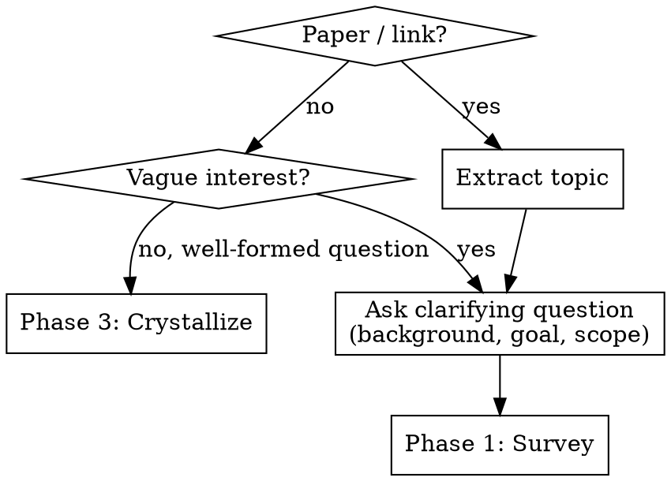
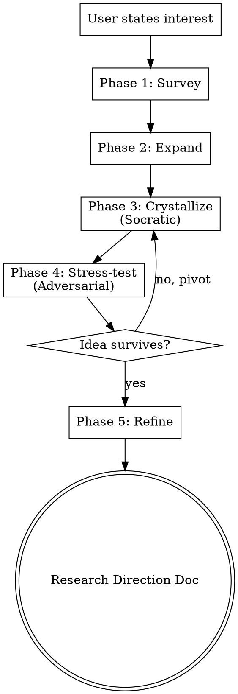

# Scientific Research Brainstorming

Research-first brainstorming. Every phase begins with autonomous search — never ask the human what the literature says; go find out. Staged posture: Socratic while the idea is forming, adversarial once it has shape. Produces a research direction document.

## Entry

Always start by asking a clarification question to understand the user's background and intent before launching into research.

**Clarification questions (pick the most relevant one):**
- "What's your background in this area? (helps calibrate the survey depth)"
- "Are you looking to start a new project, or extend existing work?"
- "Is there a specific angle or application you have in mind?"
- "What's your timeline — exploratory or deadline-driven?"

## Process

Run phases sequentially. Search autonomously at the start of each phase. Show findings before asking questions.

**One question at a time.** Never ask multiple questions in one message.

**Announce posture shifts.** Tell the human when switching from Socratic to adversarial.

### Phase 1 — Survey (automated)

Map the landscape before any discussion.

**Autonomous research:**
1. **arxiv MCP** — search topic, pull 10-15 recent papers (last 2-3 years), read abstracts
2. **paper-search-mcp** — same query across PubMed, bioRxiv, CrossRef for non-CS hits
3. **Semantic Scholar MCP** — top 5 papers: pull citation graphs, identify clusters and seminal works
4. **WebSearch** — blog posts, talks, open problem lists

**Collect articles:** Download key paper PDFs to `articles-phase-1/`. For each paper, save with filename `<first-author>-<year>-<short-title>.pdf`.

**Synthesize and answer the landscape question:**
- What is the basic landscape of this field? (key papers clustered by sub-theme, active groups, citation graph shape)
- What are the key open problems in this field?
- What are the key bottlenecks preventing progress on those problems?

**Generate survey report:** Save to `articles-phase-1/SURVEY.md` — a structured review covering: field overview, key themes with paper clusters, active research groups, open questions, and citation graph analysis.

**Ask:** "What surprises you here? What did you already know?" — answer calibrates Phase 2.

### Phase 2 — Expand (automated)

Push beyond the user's known territory.

**Strategy A — Adjacent subfield:** From Phase 1 clusters, pick the one user knows least about. **arxiv MCP** deep search + **Semantic Scholar MCP** citation chains outward.

**Strategy B — Cross-vocabulary:** Extract the **structural problem** (abstract away jargon, e.g., "compressing a high-dimensional transformation" not "LLM attention compression"). **paper-search-mcp** across all databases + **WebSearch** non-academic contexts + **Semantic Scholar MCP** to trace cross-field hits to their home community.

**Collect articles:** Download newly found paper PDFs to `articles-phase-2/`.

**Present:** adjacent subfield findings, cross-field matches (same structure, different vocabulary).

**Generate expansion report:** Save to `articles-phase-2/EXPANSION.md` — summarizing adjacent subfield findings, cross-field matches, and how structural parallels connect to the original topic.

Ask: "Which connections feel worth exploring?" User picks 1-2 → raw material for Phase 3.

### Phase 3 — Crystallize (Socratic)

Help user articulate a specific research angle. Posture: **Socratic** — only questions, no judgments.

**Targeted search:** **Semantic Scholar MCP** — check if angle has been explored. **arxiv MCP** — find closest existing work.

**Socratic questions (one at a time, adapt to context):**

*Polya's "Understanding the Problem":*
- "What specifically is new about combining [X] with [Y]?"
- "What is the unknown? What are the data? What are the conditions?"
- "Can you restate the problem in your own words?"
- "Can you draw a figure or diagram of the problem?"

*Strategic positioning:*
- "Why can you solve this bottleneck? What unique advantage do you have?"
- "Why hasn't this been solved before? What changed recently (new data, methods, compute, theory) that makes it tractable now?"

*Polya's "Devising a Plan":*
- "Have you seen a related problem before? Do you know a related problem with a known solution?"
- "Can you solve a simpler, analogous version of this problem first?"
- "Can you decompose the problem? Can you solve a part of it?"
- "What's the minimal experiment that would tell you this works?"

*Outcome and venue:*
- "What would a successful result look like?"
- "Who would care? Which venue?"

**Exit criterion:** User states idea in one sentence with clear novelty claim.

### Phase 4 — Stress-test (Adversarial)

Try to kill the idea with evidence. Whatever survives is worth pursuing.

**Posture shift:** Announce — "Now I'm going to challenge this. My job is to find reasons this doesn't work."

**Autonomous research (adversarial):** Search for prior art via **Semantic Scholar MCP** (citation chains) + **arxiv MCP** (novelty claim, negative results) + **paper-search-mcp** (cross-database) + **WebSearch** (blog posts, workshop papers).

**Collect articles:** Download prior art and counter-evidence PDFs to `articles-phase-4/`.

**Challenge on three axes:**

| Axis | Challenge | Evidence Source |
|------|-----------|----------------|
| Novelty | "I found [paper X] very similar. How is yours different?" | Semantic Scholar + arxiv |
| Rigor | "State the core claim as a theorem or testable hypothesis." | Socratic (no tool) |
| Impact | "If this works perfectly, what improvement? Enough for [venue]?" | WebSearch |

**Define success/failure criteria (ask the user):**

| Signal | Meaning |
|--------|---------|
| "What would it look like if this problem is truly solved?" | Success — define the finish line |
| "What would indicate the problem isn't solved yet, but your approach still has hope?" | Partial progress — worth continuing |
| "What would indicate your approach fundamentally doesn't work, and you should pivot?" | Failure — cut losses early |

**Outcomes:**
- Survives → Phase 5
- Dies → "Here's what killed it: [evidence]. Here's what's still interesting: [salvageable]. Want to pivot?" → loop to Phase 3

### Phase 5 — Refine (collaborative)

Produce a structured research direction document.

**Autonomous research (gap-filling):**
- **Semantic Scholar MCP** — full reference list
- **arxiv MCP** — methodology papers for planned approach
- **WebSearch** — code repos, datasets, benchmarks

**Output:** Save to `docs/plans/YYYY-MM-DD-<topic>-research-direction.md`

Structure (draft each section, show, get feedback):
- **Field Landscape** — basic picture of the field and its key problems
- **Key Bottleneck** — the specific bottleneck this work addresses
- **Research Question** — one sentence
- **Novelty Claim** — what's new (survived stress-test)
- **Why Now, Why You** — what changed to make this tractable; unique advantage
- **Key References** — from survey + expansion
- **Cross-field Connections** — unexpected links from Phase 2
- **Proposed Approach** — method outline (Polya: what is the plan?)
- **Minimum Viable Experiment** — from Phase 3 (Polya: can you solve a part of it?)
- **Success Criteria** — what does "solved" look like?
- **Warning Signs** — when to continue vs. when to pivot (from Phase 4)
- **Open Risks** — unresolved from stress-test
- **Target Venue**

*Polya's "Looking Back":* After drafting, review — can the result be derived differently? Can it be used for some other problem? Can you see the result at a glance?

## Edge Cases

| Situation | Handling |
|-----------|---------|
| User already has a well-formed research question | Skip to Phase 3 |
| Survey reveals idea is already published | Present prior art, ask if user sees a different angle |
| No cross-field connections found | Proceed with within-field survey |
| MCP tool unavailable | Fall back to WebSearch only |
| User disagrees with adversarial challenge | Present evidence, let user decide |

## Guardrails

- Never fabricate citations — only present what tools actually found.
- Never assert novelty judgments — present evidence, let user evaluate.
- Always preserve pivot path — show what's salvageable when stress-test kills an idea.
- Cite sources inline — every literature claim includes paper title or URL.
