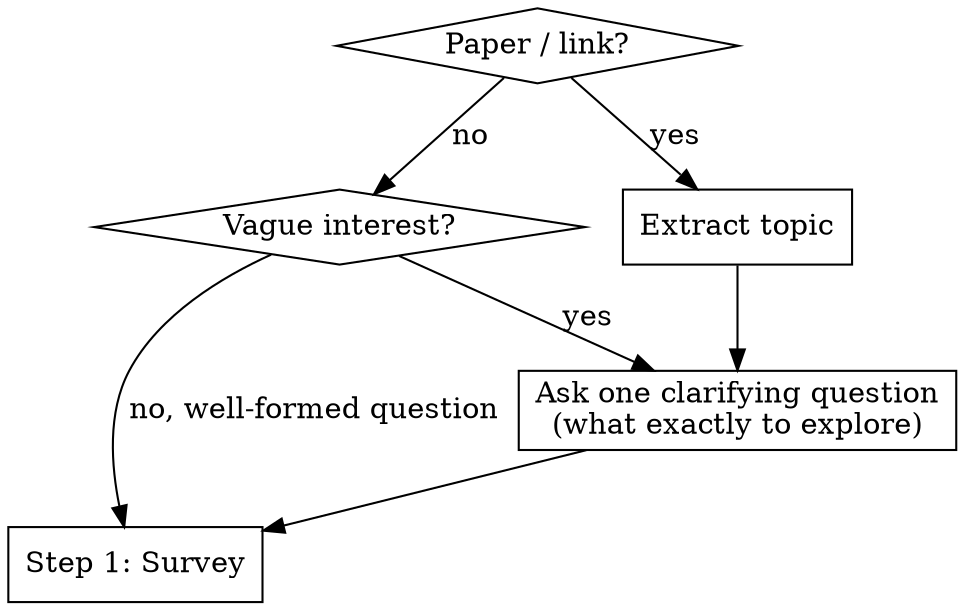
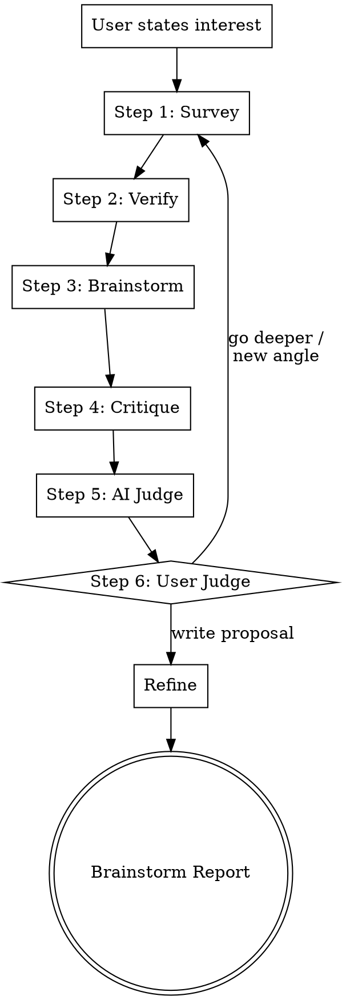

# Scientific Research Brainstorming


Research-first brainstorming adapted from the **FIDS framework** (Feel → Imagine → Do → Share).

Iterative loop: survey the field, verify findings, brainstorm ideas, critique them, then let the user decide whether to go deeper or write the proposal. Produces a research plan.

## Entry

### Step 0 — Get to know the researcher

Before anything else, ask permission to learn about the user's research background. This helps calibrate the entire session.

> "Before we start — can I learn a bit about your research background? I can:
> - **(a)** Search your local Zotero library for papers you've collected
> - **(b)** Browse your Google Scholar profile for your publications
> - **(c)** Both
> - **(d)** Skip — just start brainstorming"

**Based on the user's choice:**
- **(a)** Run the [Zotero lookup](#zotero-lookup) procedure. Summarize what you find: "You have N papers, mostly in [topics]. Recent focus seems to be [X]."
- **(b)** Fetch the Google Scholar profile (from `CLAUDE.md` or ask for the URL). Summarize: "You've published on [topics], recent work on [X], h-index Y."
- **(c)** Do both.
- **(d)** Skip. If Zotero is not auto-detected and no Scholar link is configured, print the fallback message (see [Zotero Lookup](#zotero-lookup)) and proceed.

This runs once per session, not per loop iteration.

### Clarify the research question

Then ask **one** clarification question to understand what the user actually wants to explore. Focus on narrowing the research question.



**Clarification principles:**
- **One question at a time.** Never ask multiple questions in one message.
- **Prefer multiple choice** when you can infer 2-3 plausible directions — easier for the user to pick than open-ended.
- **Focus on the actual research question:** what exactly do they want to understand, solve, or build?

## Process

Run the loop iteratively. Each iteration runs all 6 steps. The AI adapts survey strategies per iteration based on knowledge gaps. The loop repeats until the user picks a direction and exits to Refine.

**One question at a time.** Never ask multiple questions in one message.



### Step 1 — Survey (parallel exploration)

Map the landscape before any discussion. Launch N subagents in parallel. The AI selects exploration strategies dynamically based on what is known vs. unknown. First iteration is broad; later iterations focus on gaps identified in previous iterations.

**Strategy menu (AI picks from these based on iteration context):**

| # | Strategy | When to use |
|---|----------|-------------|
| 1 | **Landscape mapping** | First iteration default — broad field overview |
| 2 | **Adjacent subfield** | Deep-dive into a neighboring cluster identified in prior iteration |
| 3 | **Cross-vocabulary** | Abstract away jargon, search other fields for the same structural problem |
| 4 | **Cross-method** | Same problem, different computational or experimental approaches |
| 5 | **Historical lineage** | Who tried before, what failed, what changed since |
| 6 | **Negative results** | Search for papers showing what does not work |
| 7 | **Benchmarks and datasets** | What evaluation infrastructure exists |

**Autonomous research per subagent:**
1. **User's Zotero library** (local-first) — search the user's own paper collection before external sources. See [Zotero lookup](#zotero-lookup) below.
2. **arxiv MCP** — search topic, pull recent papers, read abstracts
3. **paper-search-mcp** — same query across PubMed, bioRxiv, CrossRef for non-CS hits
4. **Semantic Scholar MCP** — pull citation graphs, identify clusters and seminal works
5. **WebSearch** — blog posts, talks, open problem lists

**Collect articles:** Download key paper PDFs to `articles/iteration-N/survey/`. For each paper, save with filename `<first-author>-<year>-<short-title>.pdf`.

Each subagent produces a structured report with bib citations covering:
- **Field landscape** — what was found, key papers clustered by sub-theme, active research groups, citation graph shape
- **Key open problems** — what are the important unsolved questions in this area?
- **Key bottlenecks** — what specific obstacles prevent progress on those problems?

**Ask:** "What surprises you here? What did you already know?" — answer calibrates brainstorming.

### Step 2 — Verify (fact-check)

Never brainstorm on unverified foundations. Launch reviewer subagents — one per survey report from Step 1.

**Each reviewer:**
- Checks that cited papers exist (search for them by title/author)
- Verifies claims match cited abstracts
- Flags unsupported assertions
- Rates confidence per claim: high / medium / low

**Output:** Annotated reports with confidence ratings. Main agent synthesizes a **verified survey summary** — only high-confidence claims feed into brainstorming. Medium-confidence claims are flagged. Low-confidence claims are dropped with explanation.

### Step 3 — Brainstorm (human first, then AI)

The human brainstorms first — before seeing AI ideas — so they aren't anchored by what the AI generates. Then the AI runs its lenses in parallel. All ideas (human + AI) enter critique on equal footing.

**Step 3a — Human brainstorm (ask first, before launching AI subagents):**

Present the verified survey summary, then ask **one question:**

> "Based on what we've found, what ideas come to mind? Think boldly — any approach worth exploring, even if it seems risky. The critique stage will stress-test everything, so there's no cost to being ambitious."

- Wait for the user's response before proceeding.
- If the user has nothing to add, proceed to Step 3b immediately.

**Step 3b — AI brainstorm (parallel ideation):**

Launch subagents with fixed creative lenses, each receiving the verified survey summary from Step 2 **and the user's ideas** (so the AI can build on them without duplicating).

**Autonomous research per subagent:** Each brainstorm subagent searches to ground its ideas in real work, not just recombine the survey.
- **arxiv MCP** + **Semantic Scholar MCP** — find specific methods, tools, or results relevant to the lens
- **paper-search-mcp** — cross-database search for the lens-specific angle
- **WebSearch** — recent blog posts, talks, open-source tools, benchmarks that inform feasibility

**Creative lenses (one subagent per lens):**

| Lens | Strategy | Search focus |
|------|----------|-------------|
| **Combiner** | Combine two distant findings into a novel approach | Search for prior attempts at this combination |
| **Inverter** | Invert a key assumption — what if the opposite is true? | Search for evidence supporting the inverted assumption |
| **Transplanter** | Apply a method from field A to problem B | Search field A for concrete methods and their results |
| **Bottleneck-breaker** | Directly attack the identified bottleneck | Search for recent tools, techniques, or compute advances that could break it |

**Each subagent produces:**
- A concrete idea (1 paragraph)
- Why it might work, with BibTeX citations from the subagent's own search
- What would be needed to test it

**Step 3c — Merge and present all ideas:**

Combine human ideas + AI ideas into a single numbered list. Present to the user before moving to critique.

**Sharpening criteria — each idea (human or AI) must address:**

*Polya's "Understanding the Problem":*
- What specifically is new about this combination or approach?
- What is the unknown? What are the data? What are the conditions?

*Strategic positioning (Lei Wang):*
- Why can this bottleneck be solved now? What unique advantage exists?
- Why hasn't this been done before? What changed recently (new data, methods, compute, theory)?

*Polya's "Devising a Plan":*
- Have you seen a related problem before? Do you know a related problem with a known solution?
- Can you solve a simpler, analogous version first?
- Can you decompose the problem? Can you solve a part of it?
- What's the minimal experiment that would tell you this works?

Save brainstorm reports to `articles/iteration-N/brainstorm/`.

### Step 4 — Critique (adversarial review)

Try to kill each idea with evidence — AI ideas and human ideas alike. Whatever survives is worth considering.

**Each brainstorm idea (AI or human) is paired with a devil's advocate subagent that:**
- Searches for prior art (has this been tried?) via **Semantic Scholar MCP** (citation chains) + **arxiv MCP** (novelty claim, negative results) + **paper-search-mcp** (cross-database) + **WebSearch** (blog posts, workshop papers)
- Identifies the weakest assumption
- Estimates feasibility (what would it actually take?)
- Rates on three axes:

| Axis | Challenge |
|------|-----------|
| **Novelty** | "I found [paper X] very similar. How is this different?" |
| **Rigor** | "State the core claim as a testable hypothesis." |
| **Impact** | "If this works perfectly, what improvement? Enough for [venue]?" |

**Output:** Each idea has a report + counter-report pair. Save to `articles/iteration-N/critique/`.

### Step 5 — AI Judge (synthesis and ranking)

Read all report/counter-report pairs from Step 4 and make hard calls.

**Actions:**
- **Kill** ideas that did not survive critique — write a one-line epitaph explaining why each died
- **Rank** survivors by: novelty, impact, viability
- **Present** a ranked table to the user

| # | Idea | Novelty | Impact | Viability | Key risk | Status |
|---|------|---------|--------|-----------|----------|--------|
| 1 | ... | High | High | Medium | Needs X | Alive |
| 2 | ... | High | Medium | High | Prior art Y | Alive |
| 3 | ... | Medium | High | Low | Killed by Z | Dead |

Save synthesis to `articles/iteration-N/SUMMARY.md`.

### Step 6 — User Judge (human decision)

Present the ranked results. Ask **one question:**

"Which direction interests you?"
- **(a)** Pick one and write the proposal → exit loop, proceed to Refine
- **(b)** Pick one and go deeper → loop back to Step 1 with narrowed scope
- **(c)** None of these, explore differently → loop back to Step 1 with new angle from user

Analyze the user's feedback to understand their reasoning before proceeding.

### Refine (exit from loop)

Produce a **brainstorm report** — not just a plan, but a full record of the reasoning and justifications from the brainstorming process. Include what was explored, what was tried and killed, and why the surviving direction was chosen.

**Autonomous research (gap-filling):**
- **Semantic Scholar MCP** — full reference list
- **arxiv MCP** — methodology papers for planned approach
- **WebSearch** — code repos, datasets, benchmarks

**Output format:** Check `CLAUDE.md`/`AGENTS.md` for a configured report format. If not configured, ask the user:

> "What format for the brainstorm report?"
> - **(a)** Typst (`.typ`) — recommended, native BibTeX support, compiles to PDF
> - **(b)** LaTeX (`.tex`) — full BibTeX support, traditional academic format
> - **(c)** Markdown (`.md`) — note: limited BibTeX support, citations will be inline text rather than rendered references

Save to `articles/YYYY-MM-DD-<topic>-brainstorm-report.{md,typ,tex}` (with matching `references.bib`).

Structure (draft each section, show, get feedback):

*Part 1 — What we explored (reasoning trail):*
- **Field Landscape** — basic picture of the field and its key problems
- **Key Bottleneck** — the specific bottleneck this work addresses
- **Survey Trail** — what strategies were used per iteration, what was discovered, what shifted our understanding
- **Ideas Explored** — all ideas generated (human + AI), with the reasoning behind each
- **Ideas Killed** — which ideas were eliminated, the evidence and critique that killed them (epitaphs from Step 5)
- **Ideas Survived** — which ideas survived critique and why

*Part 2 — The chosen direction:*
- **Research Question** — one sentence
- **Novelty Claim** — what's new (survived critique in Step 4)
- **Why Now, Why You** — what changed to make this tractable; unique advantage
- **Cross-field Connections** — unexpected links from cross-vocabulary / transplanter strategies
- **Proposed Approach** — method outline (Polya: what is the plan?)
- **Minimum Viable Experiment** — (Polya: can you solve a part of it?)
- **Success Signal** — what would it look like if this problem is truly solved?
- **Hope Signal** — what would indicate the problem isn't solved yet, but the approach still has hope?
- **Pivot Signal** — what would indicate this approach fundamentally doesn't work, and it's time to abandon or change direction?
- **Open Risks** — unresolved from critique
- **Target Venue**

*Part 3 — References:*
- **Key References** — full BibTeX entries from all survey iterations
- **BibTeX file** — save as `articles/YYYY-MM-DD-<topic>-references.bib`

*Polya's "Looking Back":* After drafting, review — can the result be derived differently? Can it be used for some other problem? Can you see the result at a glance?

## Zotero Lookup

The user's personal Zotero library is a high-value source — it contains papers they already know and trust. Search it before external sources.

**Step 1 — Locate the Zotero data directory:**
1. Check standard paths: `~/Zotero/`, `~/Library/Application Support/Zotero/` (macOS alternate)
2. Look for `zotero.sqlite` in the directory
3. If not found, ask the user for the path (one question)

**Step 2 — Search by keyword via SQLite:**
```bash
sqlite3 ~/Zotero/zotero.sqlite "
  SELECT i.itemID, v_title.value AS title, v_abstract.value AS abstract
  FROM items i
  JOIN itemData id_t ON i.itemID = id_t.itemID
  JOIN itemDataValues v_title ON id_t.valueID = v_title.valueID
  JOIN fields f_t ON id_t.fieldID = f_t.fieldID AND f_t.fieldName = 'title'
  LEFT JOIN itemData id_a ON i.itemID = id_a.itemID
  LEFT JOIN fields f_a ON id_a.fieldID = f_a.fieldID AND f_a.fieldName = 'abstractNote'
  LEFT JOIN itemDataValues v_abstract ON id_a.valueID = v_abstract.valueID
  WHERE v_title.value LIKE '%KEYWORD%'
     OR v_abstract.value LIKE '%KEYWORD%'
  LIMIT 20;
"
```

**Step 3 — Find PDFs for matched items:**
```bash
sqlite3 ~/Zotero/zotero.sqlite "
  SELECT ia.parentItemID, ia.key, ia.contentType
  FROM itemAttachments ia
  WHERE ia.parentItemID IN (ITEM_IDS)
    AND ia.contentType = 'application/pdf';
"
```
PDFs are stored at `~/Zotero/storage/<key>/<filename>.pdf`.

**Step 4 — Analyze matched PDFs:**
- Use the **Read** tool to read PDFs directly (supports PDF reading)
- For bulk keyword search across many PDFs: `pdfgrep -r -i "KEYWORD" ~/Zotero/storage/` (install via `brew install pdfgrep` if missing)
- For each relevant paper found, extract: title, key claims, methods, results relevant to the research question

**Fallback:** If Zotero is not found, print the following message and proceed with external sources:

> Could not locate a local PDF library (Zotero). Proceeding with online sources only. If you have a paper collection, you can add your research preferences and PDF locations to `CLAUDE.md` or `AGENTS.md` — for example:
>
> ```
> My Zotero library is at ~/Zotero/
> My PDFs are in ~/Papers/
> My Google Scholar: https://scholar.google.com/citations?user=XXXX
> My research interests: [topic], [topic]
> ```
>
> This helps the AI understand your research style, find your local papers, and browse your publication history in future sessions.

Do not ask more than once per session.

## Edge Cases

| Situation | Handling |
|-----------|---------|
| User already has a well-formed research question | Skip Entry, start loop at Step 1 |
| Survey reveals idea is already published | Present prior art in Step 2 verification, ask if user sees a different angle |
| No cross-field connections found | Proceed with within-field survey; Transplanter lens may still find methods from other fields |
| Zotero not installed | Skip local library search, proceed with external sources only |
| MCP tool unavailable | Fall back to WebSearch only |
| User disagrees with critique | Present evidence, let user decide — user always has final say at Step 6 |
| All ideas killed in Step 5 | Report what was learned, suggest new angles, loop back to Step 1 with adjusted strategies |

## Guardrails

- Never fabricate citations — only present what tools actually found.
- Never assert novelty judgments — present evidence, let user evaluate.
- Always verify before brainstorming — Step 2 must complete before Step 3 starts. Never brainstorm on unverified claims.
- Always preserve pivot path — show what's salvageable when critique kills an idea.
- Cite sources with bibtex — every literature claim includes paper title or URL.
