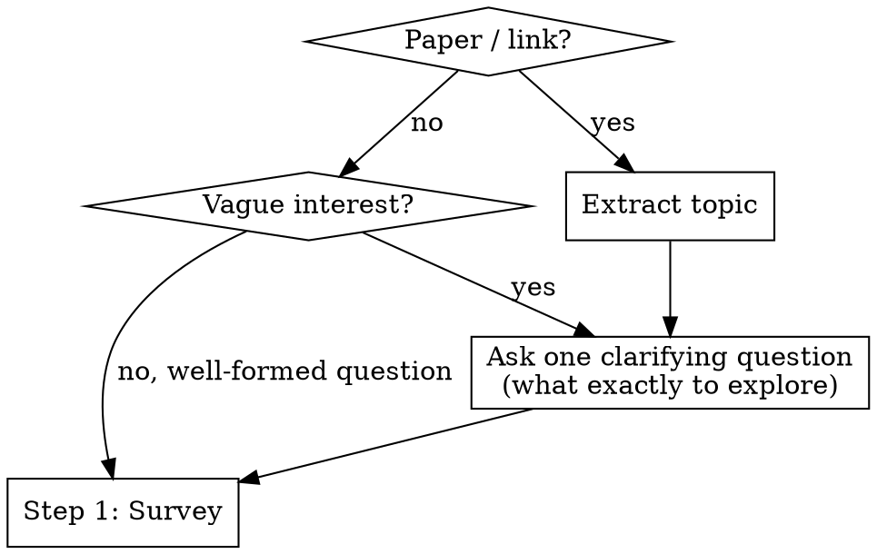
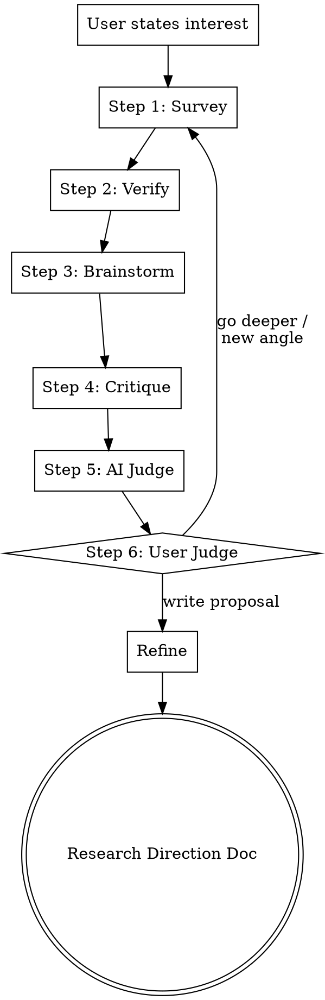

# Scientific Research Brainstorming

Research-first brainstorming. Every step begins with autonomous search — never ask the human what the literature says; go find out. Iterative loop: survey the field, verify findings, brainstorm ideas, critique them, then let the user decide whether to go deeper or write the proposal. Produces a research direction document.

## Entry

Before launching into research, ask **one** clarification question to understand what the user actually wants to explore. Focus on narrowing the research question — not on background or logistics.

**Clarification principles:**
- **One question at a time.** Never ask multiple questions in one message.
- **Prefer multiple choice** when you can infer 2-3 plausible directions — easier for the user to pick than open-ended.
- **Focus on the actual research question:** what exactly do they want to understand, solve, or build?

**Example clarification questions (pick the most relevant one):**
- "I see a few angles here: (a) improving X's efficiency, (b) applying X to domain Y, (c) theoretical foundations of X. Which is closest to what you're thinking?"
- "This paper proposes [method]. Are you interested in extending it, finding alternatives, or applying it to a different problem?"
- "What would success look like — a new algorithm, a theoretical result, or an empirical study?"

## Process

Run the loop iteratively. Each iteration runs all 6 steps. The AI adapts survey strategies per iteration based on knowledge gaps. The loop repeats until the user picks a direction and exits to Refine.

**One question at a time.** Never ask multiple questions in one message.

### Step 1 — Survey (parallel exploration)

Map the landscape before any discussion. Launch N subagents in parallel. The AI selects exploration strategies dynamically based on what is known vs. unknown. First iteration is broad; later iterations focus on gaps identified in previous iterations.

**Strategy menu (AI picks from these based on iteration context):**

| # | Strategy | When to use |
|---|----------|-------------|
| 1 | **Landscape mapping** | First iteration default — broad field overview |
| 2 | **Adjacent subfield** | Deep-dive into a neighboring cluster identified in prior iteration |
| 3 | **Cross-vocabulary** | Abstract away jargon, search other fields for the same structural problem |
| 4 | **Cross-method** | Same problem, different computational or experimental approaches |
| 5 | **Historical lineage** | Who tried before, what failed, what changed since |
| 6 | **Negative results** | Search for papers showing what does not work |
| 7 | **Benchmarks and datasets** | What evaluation infrastructure exists |

**Autonomous research per subagent:**
1. **arxiv MCP** — search topic, pull recent papers, read abstracts
2. **paper-search-mcp** — same query across PubMed, bioRxiv, CrossRef for non-CS hits
3. **Semantic Scholar MCP** — pull citation graphs, identify clusters and seminal works
4. **WebSearch** — blog posts, talks, open problem lists

**Collect articles:** Download key paper PDFs to `articles/iteration-N/survey/`. For each paper, save with filename `<first-author>-<year>-<short-title>.pdf`.

Each subagent produces a structured report with inline citations covering:
- **Field landscape** — what was found, key papers clustered by sub-theme, active research groups, citation graph shape
- **Key open problems** — what are the important unsolved questions in this area?
- **Key bottlenecks** — what specific obstacles prevent progress on those problems?

**Ask:** "What surprises you here? What did you already know?" — answer calibrates brainstorming.

### Step 2 — Verify (fact-check)

Never brainstorm on unverified foundations. Launch reviewer subagents — one per survey report from Step 1.

**Each reviewer:**
- Checks that cited papers exist (search for them by title/author)
- Verifies claims match cited abstracts
- Flags unsupported assertions
- Rates confidence per claim: high / medium / low

**Output:** Annotated reports with confidence ratings. Main agent synthesizes a **verified survey summary** — only high-confidence claims feed into brainstorming. Medium-confidence claims are flagged. Low-confidence claims are dropped with explanation.

### Step 3 — Brainstorm (parallel ideation)

Generate concrete research ideas using fixed creative lenses. Launch subagents, each receiving the verified survey summary from Step 2.

**Autonomous research per subagent:** Each brainstorm subagent searches to ground its ideas in real work, not just recombine the survey.
- **arxiv MCP** + **Semantic Scholar MCP** — find specific methods, tools, or results relevant to the lens
- **paper-search-mcp** — cross-database search for the lens-specific angle
- **WebSearch** — recent blog posts, talks, open-source tools, benchmarks that inform feasibility

**Creative lenses (one subagent per lens):**

| Lens | Strategy | Search focus |
|------|----------|-------------|
| **Combiner** | Combine two distant findings into a novel approach | Search for prior attempts at this combination |
| **Inverter** | Invert a key assumption — what if the opposite is true? | Search for evidence supporting the inverted assumption |
| **Transplanter** | Apply a method from field A to problem B | Search field A for concrete methods and their results |
| **Bottleneck-breaker** | Directly attack the identified bottleneck | Search for recent tools, techniques, or compute advances that could break it |

**Each subagent produces:**
- A concrete idea (1 paragraph)
- Why it might work, with citations from the subagent's own search
- What would be needed to test it

**Sharpening criteria — each idea must address:**

*Polya's "Understanding the Problem":*
- What specifically is new about this combination or approach?
- What is the unknown? What are the data? What are the conditions?

*Strategic positioning (Lei Wang):*
- Why can this bottleneck be solved now? What unique advantage exists?
- Why hasn't this been done before? What changed recently (new data, methods, compute, theory)?

*Polya's "Devising a Plan":*
- Have you seen a related problem before? Do you know a related problem with a known solution?
- Can you solve a simpler, analogous version first?
- Can you decompose the problem? Can you solve a part of it?
- What's the minimal experiment that would tell you this works?

Save brainstorm reports to `articles/iteration-N/brainstorm/`.

### Step 4 — Critique (adversarial review)

Try to kill each idea with evidence. Whatever survives is worth considering.

**Each brainstorm idea is paired with a devil's advocate subagent that:**
- Searches for prior art (has this been tried?) via **Semantic Scholar MCP** (citation chains) + **arxiv MCP** (novelty claim, negative results) + **paper-search-mcp** (cross-database) + **WebSearch** (blog posts, workshop papers)
- Identifies the weakest assumption
- Estimates feasibility (what would it actually take?)
- Rates on three axes:

| Axis | Challenge |
|------|-----------|
| **Novelty** | "I found [paper X] very similar. How is this different?" |
| **Rigor** | "State the core claim as a testable hypothesis." |
| **Impact** | "If this works perfectly, what improvement? Enough for [venue]?" |

**Output:** Each idea has a report + counter-report pair. Save to `articles/iteration-N/critique/`.

### Step 5 — AI Judge (synthesis and ranking)

Read all report/counter-report pairs from Step 4 and make hard calls.

**Actions:**
- **Kill** ideas that did not survive critique — write a one-line epitaph explaining why each died
- **Rank** survivors by: novelty, impact, viability
- **Present** a ranked table to the user

| # | Idea | Novelty | Impact | Viability | Key risk | Status |
|---|------|---------|--------|-----------|----------|--------|
| 1 | ... | High | High | Medium | Needs X | Alive |
| 2 | ... | High | Medium | High | Prior art Y | Alive |
| 3 | ... | Medium | High | Low | Killed by Z | Dead |

Save synthesis to `articles/iteration-N/SUMMARY.md`.

### Step 6 — User Judge (human decision)

Present the ranked results. Ask **one question:**

"Which direction interests you?"
- **(a)** Pick one and write the proposal → exit loop, proceed to Refine
- **(b)** Pick one and go deeper → loop back to Step 1 with narrowed scope
- **(c)** None of these, explore differently → loop back to Step 1 with new angle from user

Analyze the user's feedback to understand their reasoning before proceeding.

### Refine (exit from loop)

Produce a structured research direction document incorporating all accumulated survey findings, ideas, and critique from loop iterations.

**Autonomous research (gap-filling):**
- **Semantic Scholar MCP** — full reference list
- **arxiv MCP** — methodology papers for planned approach
- **WebSearch** — code repos, datasets, benchmarks

**Output:** Save to `docs/plans/YYYY-MM-DD-<topic>-research-direction.md`

Structure (draft each section, show, get feedback):
- **Field Landscape** — basic picture of the field and its key problems
- **Key Bottleneck** — the specific bottleneck this work addresses
- **Research Question** — one sentence
- **Novelty Claim** — what's new (survived critique in Step 4)
- **Why Now, Why You** — what changed to make this tractable; unique advantage
- **Key References** — from survey iterations
- **Cross-field Connections** — unexpected links from cross-vocabulary / transplanter strategies
- **Proposed Approach** — method outline (Polya: what is the plan?)
- **Minimum Viable Experiment** — (Polya: can you solve a part of it?)
- **Success Signal** — what would it look like if this problem is truly solved?
- **Hope Signal** — what would indicate the problem isn't solved yet, but the approach still has hope?
- **Pivot Signal** — what would indicate this approach fundamentally doesn't work, and it's time to abandon or change direction?
- **Open Risks** — unresolved from critique
- **Target Venue**

*Polya's "Looking Back":* After drafting, review — can the result be derived differently? Can it be used for some other problem? Can you see the result at a glance?

## Edge Cases

| Situation | Handling |
|-----------|---------|
| User already has a well-formed research question | Skip Entry, start loop at Step 1 |
| Survey reveals idea is already published | Present prior art in Step 2 verification, ask if user sees a different angle |
| No cross-field connections found | Proceed with within-field survey; Transplanter lens may still find methods from other fields |
| MCP tool unavailable | Fall back to WebSearch only |
| User disagrees with critique | Present evidence, let user decide — user always has final say at Step 6 |
| All ideas killed in Step 5 | Report what was learned, suggest new angles, loop back to Step 1 with adjusted strategies |

## Guardrails

- Never fabricate citations — only present what tools actually found.
- Never assert novelty judgments — present evidence, let user evaluate.
- Always verify before brainstorming — Step 2 must complete before Step 3 starts. Never brainstorm on unverified claims.
- Always preserve pivot path — show what's salvageable when critique kills an idea.
- Cite sources inline — every literature claim includes paper title or URL.
